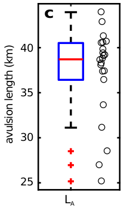
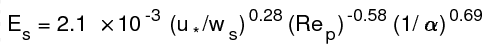

# Matlab and R functions and models repository

This repository contains tools I have written that I frequently use in modeling or calculations. 

It is mostly exceptionally basic functions that either store static but helpful information (e.g., physical constants, color sets) or perform routine operations that are simple but take up a lot of lines of code (i.e., cleans up the workspace).

It also contains a few simple self contained models I have developed.

A summary of _some_ of the functions in here is included. See the file for more documentation.

### categorical2jitterMat.m

`categorical2jitterMat` reshapes data for parallel boxplot-jitterplot.

 

### dist2bulk.m

`dist2bulk` calculates the bulk value of a sample given per-class values and a grain size distribution. Output is numeric.
For example, `[bulk] = dist2bulk(dist, val)`

### formatRegression.m

`formatRegression` formats a linearized multivariate regression matrix to a power law regression string.
For example, `formatRegression(beta, {'u_*/w_s', 'Re_p', '1/\alpha'})` returns the string to be formatted with `text` as

### get_DSV.m

`get_DSV` is the Dietrich settling velocity (Dietrich, 1982) in m/s for grain size. Can handle arbitrary shaped matrix and a Corey shape factor, Power's index and set of physical constants (see `load_conset.m`. 

### get_criticalstress.m

### inspire.m

### load_colorSet.m

### load_conset.m

### modelEvalPts.m

### sprintsci.m

sprintsci` prints number in fully formatted scientific notation. 
E.g., `sprintsci(0.0483244)` returns a string `'4.832\times10^{-2}'`.